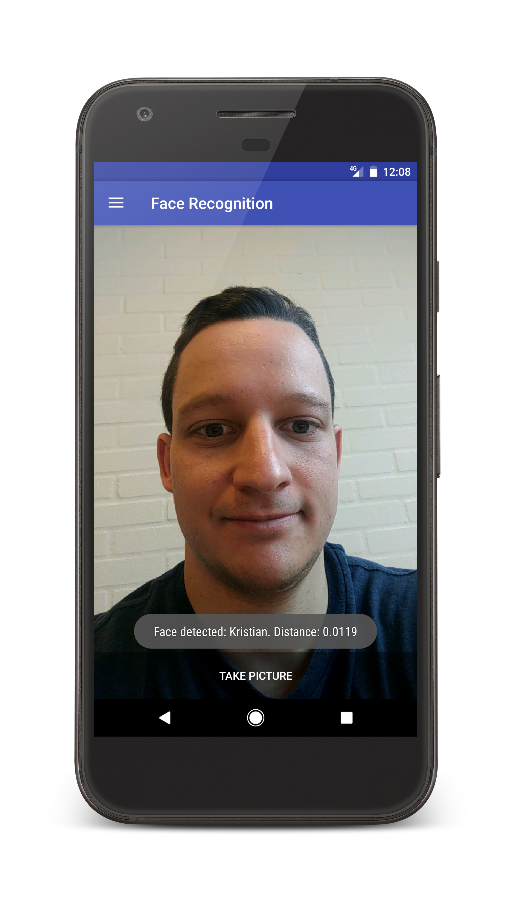
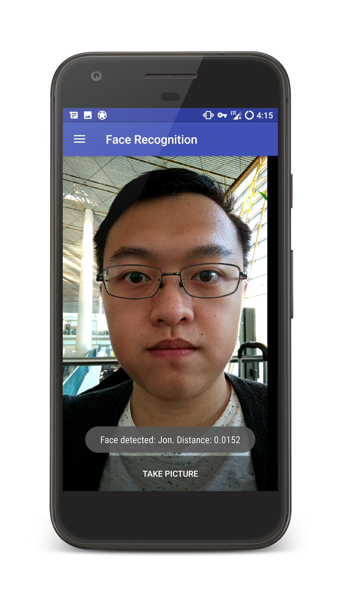
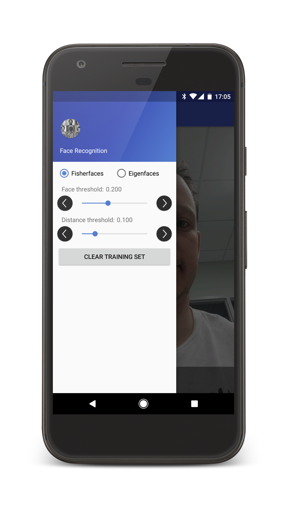

# Face Recognition Android App

<a href="http://play.google.com/store/apps/details?id=com.lauszus.facerecognitionapp"></a>

#### Developed by Kristian Lauszus, 2016

The code is released under the GNU General Public License.
_________
[](https://travis-ci.org/Lauszus/FaceRecognitionApp)

This project demonstrates how to calculate Eigenfaces and Fisherfaces used for face recognition on an Android device.

The library uses my other project [FaceRecognitionLib](https://github.com/Lauszus/FaceRecognitionLib) in order to calculate the Eigenfaces and Fisherfaces.

A short blog post can be found at the following link: <http://blog.tkjelectronics.dk/2017/07/face-recognition-using-eigenfaces-and-fisherfaces>.

The reports I wrote together with Jonathan Wang can be found at the following links: [Eigenfaces\_Report.pdf](https://github.com/Lauszus/FaceRecognitionLib/raw/master/Eigenfaces_Report.pdf) and [Final\_Project\_Report.pdf](https://github.com/Lauszus/FaceRecognitionLib/raw/master/Final_Project_Report.pdf).

## Screenshots



## Build instructions

In order to built this project you need to download and install [Android Studio](http://developer.android.com/sdk/index.html). You will then need to install the [Android NDK](https://developer.android.com/studio/projects/add-native-code.html#download-ndk).

Then simply download the latest release: <https://github.com/Lauszus/FaceRecognitionApp/releases/download/1.2.3/FaceRecognitionApp-1.2.3.zip> and open the project in Android Studio.

## Advanced build instructions

The following instructions are meant for advanced users who wants to clone and modify the source files.

First clone the repository including the submodule:

```bash
git clone --recursive https://github.com/Lauszus/FaceRecognitionApp.git
```

If you have already cloned the project, then please run the following command in order to initialize the submodule:

```bash
git submodule update --init --recursive
```

The project is relying on the environmental variables ```OPENCV_ANDROID_SDK``` and ```EIGEN3_DIR``` for [settings.gradle](settings.gradle) and [Android.mk](app/src/main/cpp/Android.mk) to be set to the path of the [OpenCV Android SDK](http://opencv.org/platforms/android) and [Eigen3](https://eigen.tuxfamily.org) libraries.

Please use [OpenCV 3.4.1](https://github.com/opencv/opencv/releases/download/3.4.1/opencv-3.4.1-android-sdk.zip) and [Eigen3 3.3.5](https://bitbucket.org/eigen/eigen/get/3.3.5.zip). Both can be installed from the command line like so:

```bash
wget https://github.com/opencv/opencv/releases/download/3.4.1/opencv-3.4.1-android-sdk.zip
unzip opencv-3.4.1-android-sdk.zip
wget https://bitbucket.org/eigen/eigen/get/3.3.5.zip -O Eigen3.zip
unzip Eigen3.zip
```

Now simple set the environmental variables:

Linux:

```bash
nano ~/.bash_profile
export OPENCV_ANDROID_SDK=/path/to/OpenCV-android-sdk
export EIGEN3_DIR=/path/to/eigen3
echo $OPENCV_ANDROID_SDK $EIGEN3_DIR
```

Mac:

```bash
nano /etc/launchd.conf
setenv OPENCV_ANDROID_SDK /path/to/OpenCV-android-sdk
setenv EIGEN3_DIR /path/to/eigen3
echo $OPENCV_ANDROID_SDK $EIGEN3_DIR
```

Windows:

```bash
setx OPENCV_ANDROID_SDK /path/to/OpenCV-android-sdk
setx EIGEN3_DIR /path/to/eigen3
echo %OPENCV_ANDROID_SDK% %EIGEN3_DIR%
```

__Please note that ```/path/to/``` should be replaced with the actual path to the Eigen and OpenCV Android SDK directories.__

If you have troubles setting the environmental variables, then you can just hardcode the paths in [settings.gradle](settings.gradle) and [Android.mk](app/src/main/cpp/Android.mk).
